### 介绍

* 全部都用`localStorage`,没有与服务器的交互
* 视频详情数据没有~但是你可以自己做
* 添加了导航守卫
* 地址编辑页没有写~,你可以自己写
* 其他都OK,具体仔细体验~巴拉巴拉(应付应付最后的作业~~)
* 下载地址
  * [github](https://github.com/superBiuBiuMan/vuefor_51shop)
  * [gitee](https://gitee.com/superBiuBiu/vuefor_51shop)
* 在线演示
  * [@地址](https://vuefor-51shop.vercel.app/)

* 使用
  * 第一步: 当前目录下命令行运行`npm install `
  * 第二步: 当前目录下命名行运行`npm run serve `
  * 第三步: 浏览器输入`http://localhost:8080/`进入

### 图片展示

#### 首页

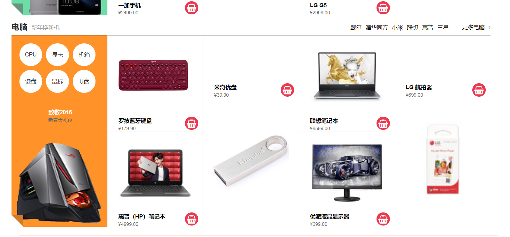

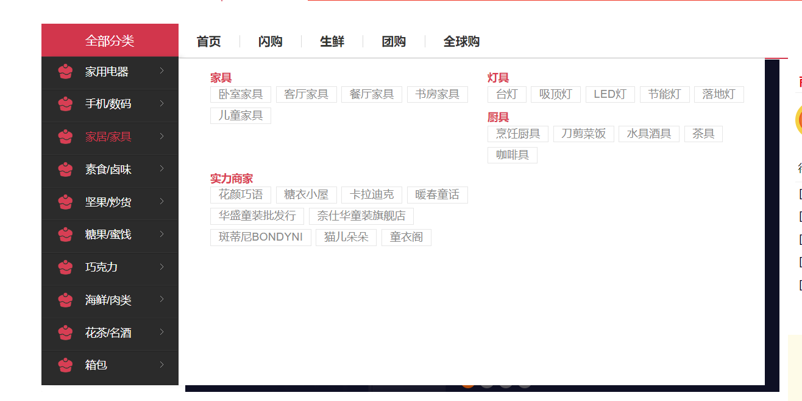

#### 购物车页

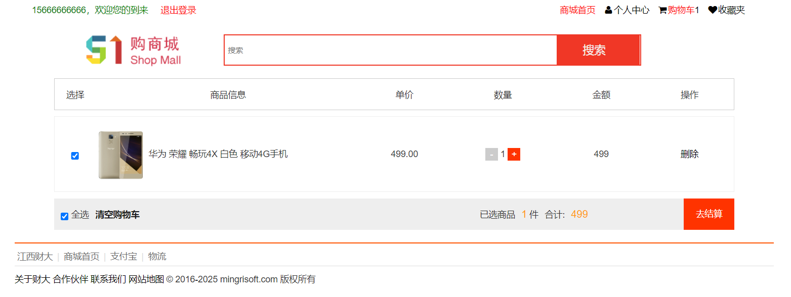

#### 结算页

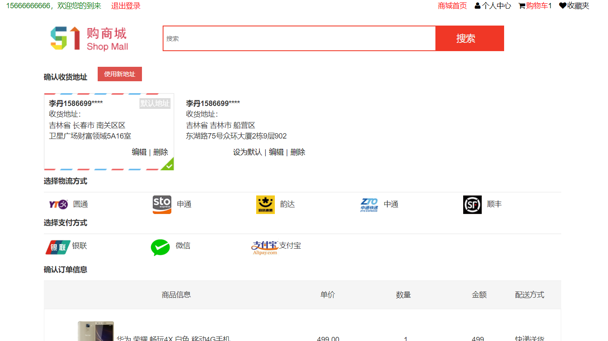

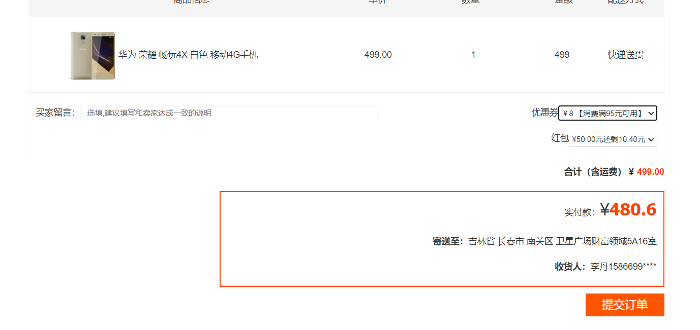

#### 登录页

* 密码使用aes加密了

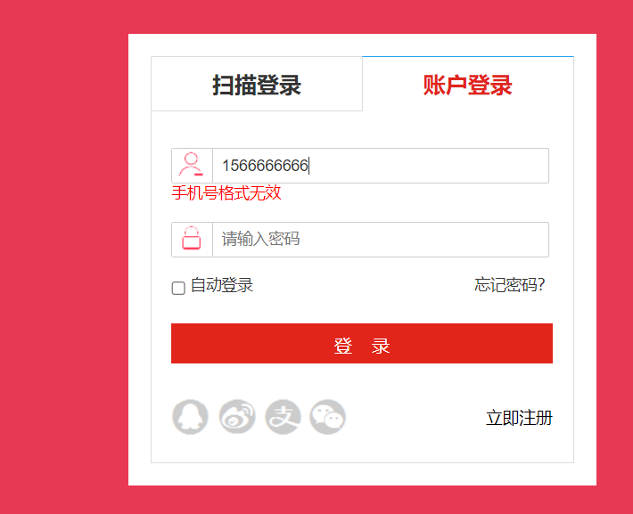

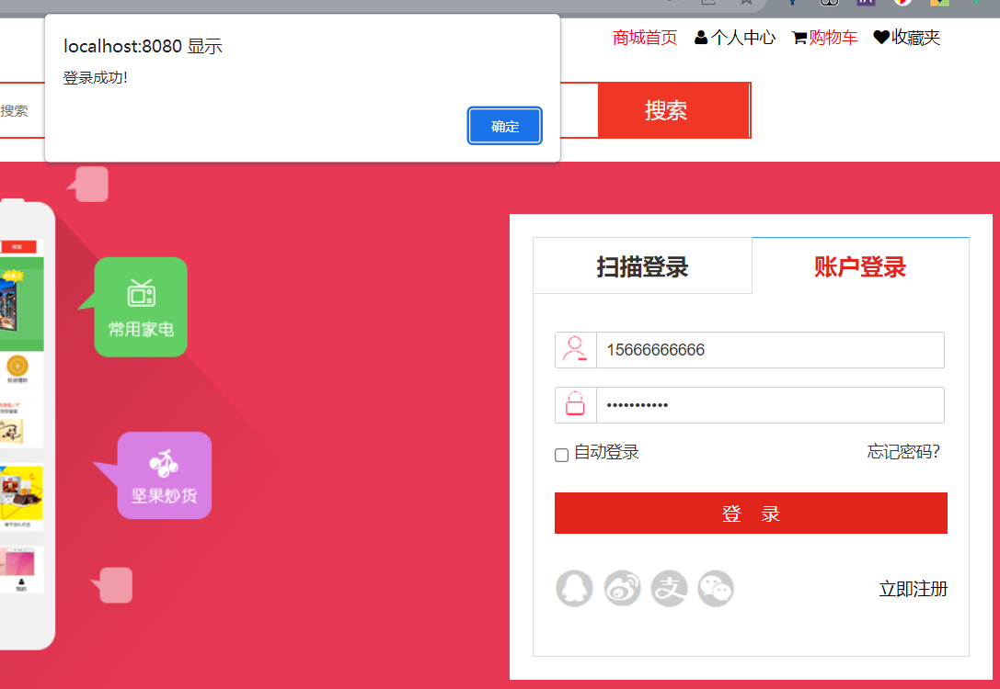

#### 注册页

* 会检索本地数据,如果有的话就会注册失败!

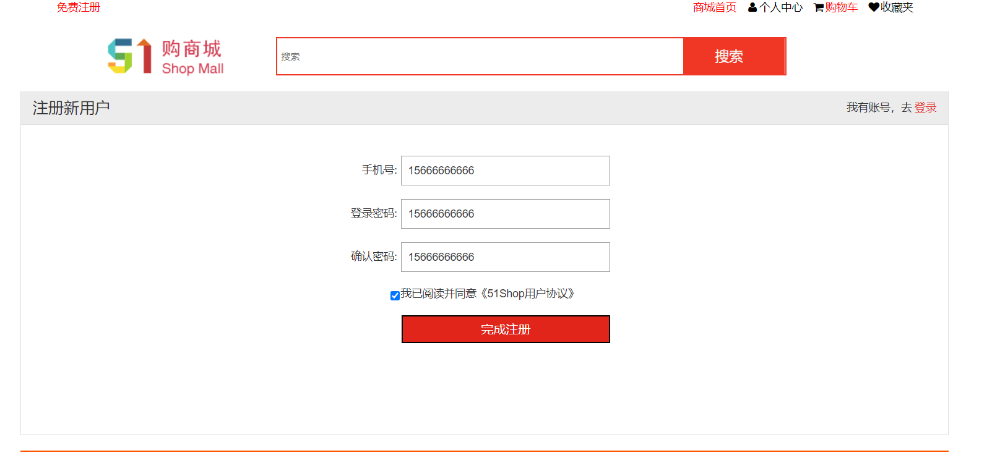

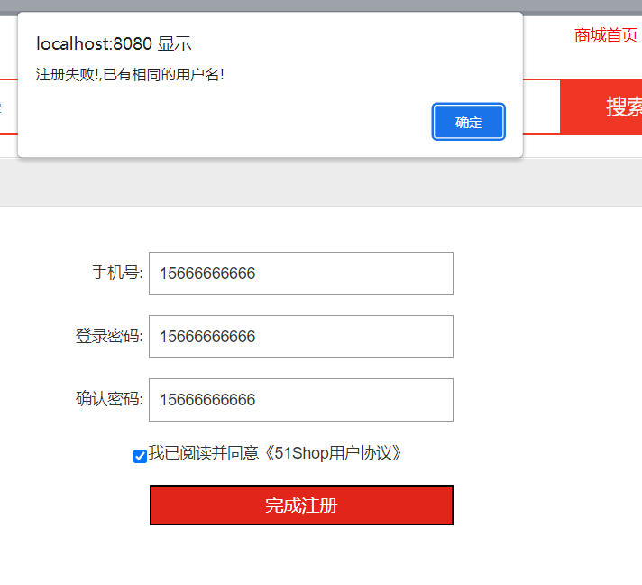

#### 商品详情

* 有一个放大镜效果~

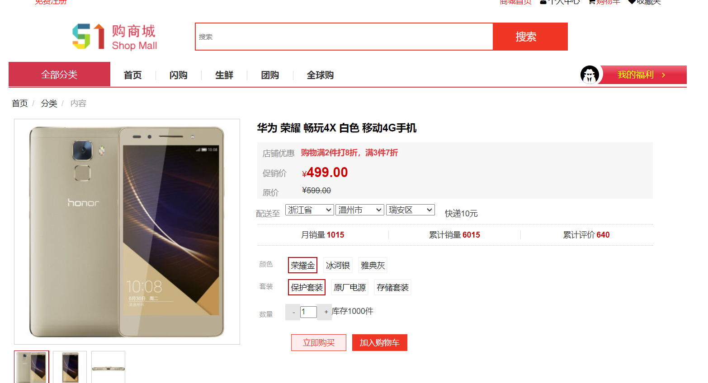

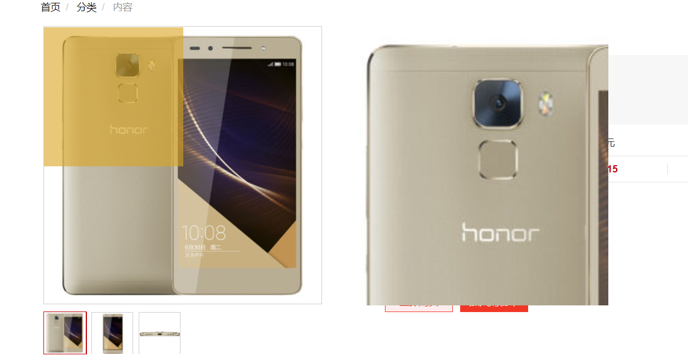

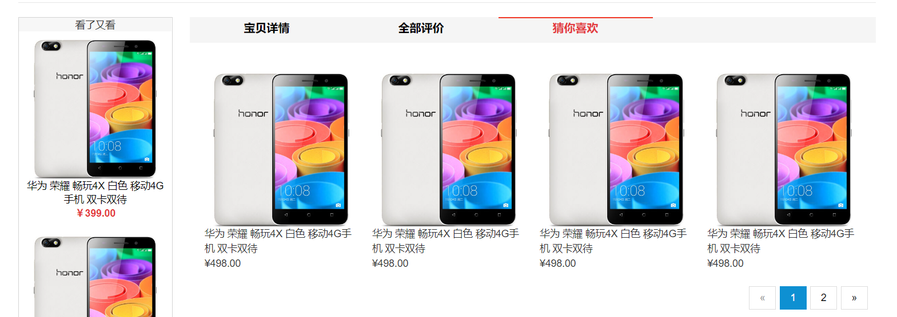

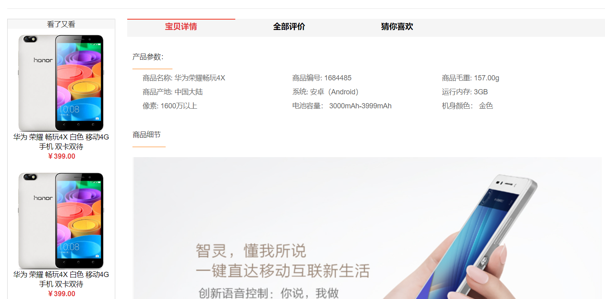

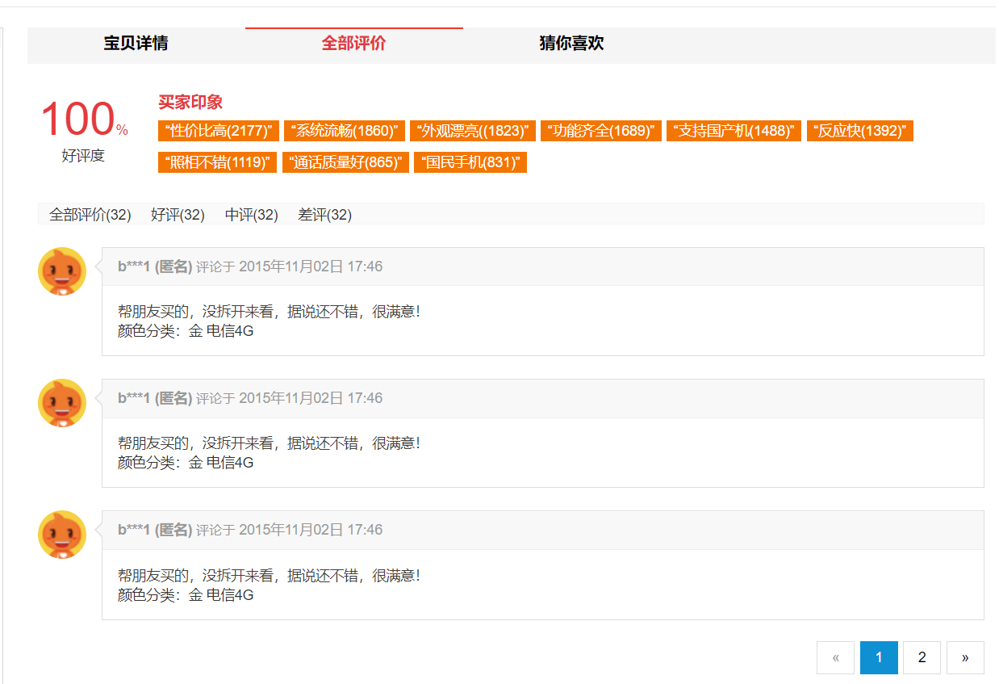